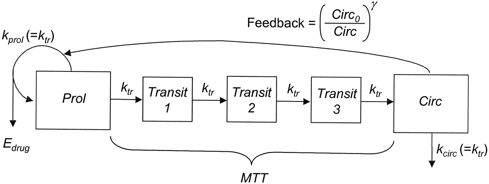

<style type="text/css">
slides > slide:not(.nobackground):after {
  content: '';
}
.forceBreak { -webkit-column-break-after: always; break-after: column; }
</style>

```{r setup, include=FALSE}
options(width = 90)
library(knitr)
knit_hooks$set(small.mar = function(before, options, envir) {
    if (before) par(mar = c(4, 4, .1, .1), las = 1)  # smaller margin on top and right
})
hook_output <- knit_hooks$get("output")
knit_hooks$set(output = function(x, options) {
  lines <- options$output.lines
  if (is.null(lines)) {
    return(hook_output(x, options))  # pass to default hook
  }
  x <- unlist(strsplit(x, "\n"))
  more <- "..."
  if (length(lines)==1) {        # first n lines
    if (length(x) > lines) {
      # truncate the output, but add ....
      x <- c(head(x, lines), more)
    }
  } else {
    x <- c(more, x[lines], more)
  }
  # paste these lines together
  x <- paste(c(x, ""), collapse = "\n")
  hook_output(x, options)
})
library(rstan)
library(rstanarm)
library(projpred)
library(brms)
library(rstantools)
library(bmlm)
library(gbiqq)
options(mc.cores = 4L)
rstan_options(auto_write = TRUE)
```

## Outline

* There are many R packages that come with Stan programs or do things with Stan output
* Focus here is on those maintained by Stan developers and / or people at Columbia

## The rstanarm Package

The [rstanarm](http://mc-stan.org/rstanarm/) package comes with several Stan programs
for regression but uses the same syntax and likelihood as core R functions, such as
`lm`, `glm`, `lme4::glmer`, `mgcv::gam`, etc.

```{r, kidiq, results = "hide", warning = FALSE}
(post <- stan_lm(kid_score ~ mom_hs + mom_age + mom_iq, data = kidiq, prior = R2(.3, "mean")))
```
```{r, output.lines = -(1:6), echo = FALSE}
post
```

## The shinystan Package

The [shinystan](http://mc-stan.org/shinystan/) package allows you to visualize the
posterior distribution, which is particularly useful for diagnosing problems with models

```{r, eval = FALSE}
launch_shinystan(post) # opens app in default web browser
```

## The bayesplot Package

The [bayesplot](http://mc-stan.org/bayesplot/) package can be used with rstanarm, rstan, etc. 
to visualize implications of posterior distributions, such as leave-one-out posterior predictions
```{r, message = FALSE, fig.height = 4, fig.width = 10}
pp_check(post, plotfun = "loo_intervals", order = "median") # -> bayesplot::ppc_loo_intervals
```

## The loo Package

The [loo](http://mc-stan.org/loo/) package calculates an approximation to the Expected Log 
Predictive Density (ELPD) of $N$ future observations, which is used for model comparison
```{r}
loo(post)
```

## Stacking Weights in the loo Package

The [loo](http://mc-stan.org/loo/) package can also be used to choose the optimal weights over 
competing models to maximize the ELPD, such as this one that excludes `mom_hs`
```{r, results="hide", warning = FALSE}
post_no_hs <- update(post, formula. = . ~ . -mom_hs)
```
```{r}
loo_model_weights(stanreg_list(post, post_no_hs))
```

## The projpred Package

The [projpred](http://mc-stan.org/projpred/) package chooses a submodel of an original model
that has almost the same ELPD but still preserves posterior uncertainty correctly

```{r, message = FALSE, fig.height = 4, fig.width = 10}
varsel_plot(varsel(post, method = "forward"), stats=c("elpd", "rmse"))
```

## The brms Package {.smaller}

The [brms](https://github.com/paul-buerkner/brms/) package generates Stan programs from R syntax 
at runtime, which allows it to to fit a more extensive set of regression models flexibly. The
`make_stancode` and `make_standata` functions are useful.

```{r, brm, cache = TRUE, results = "hide", warning = FALSE, message = FALSE}
(post <- brm(time | cens(censored) ~ age * sex + disease + (1 | patient), data = kidney, family = weibull))
```
```{r, echo = FALSE, output.lines = -(1:7)}
post
```

## Visualizing Partial Conditional Mean Functions

The [brms](https://github.com/paul-buerkner/brms/) package has an extensive set of plots that
allow you to visualize the implications of the models that it estimates
```{r, fig.height = 4, fig.width = 10}
plot(marginal_effects(post, effects = "age:sex"))
```

## Creating your own R Packages that Use Stan

The [rstantools](https://mc-stan.org/rstantools/articles/index.html) package has generic functions 
and a step-by-step guide for you to create an R package that wraps a Stan program you write
```{r, eval = FALSE}
rstan_create_package(path = 'new_package', stan_files = "my_model.stan")
```
At this point, the package directory is setup and can be compiled, but you need to write an
R function that inputs syntax and data to be parsed and passed to the `data` block of 
my_model.stan .

## The bmlm Package

The [bmlm](https://mvuorre.github.io/bmlm/) package was built via `rstantools::rstan_create_package`
and comes with Stan programs to estimate mediation models
```{r, bmlm, cache = TRUE, results = "hide", message = FALSE, warning = FALSE}
BLch9 <- isolate(BLch9, by = "id", value = c("fwkstrs", "fwkdis", "freldis"))
post <- mlm(d =  BLch9, id = "id", x = "fwkstrs_cw", m = "fwkdis_cw", y = "freldis_cw")
```
```{r, fig.height = 3, fig.width = 10}
mlm_path_plot(post, level = .9, text = TRUE, digits = 2, xlab = "Work\nstressors",
              mlab = "Work\ndissatisfaction", ylab = "Relationship\ndissatisfaction")
```

## The gbiqq Package {.smaller}

The [gbiqq](https://macartan.github.io/causalmodels/) package comes with a general Stan program
that estimates the causal implications of any Directed Acyclic Graph (DAG) with binary nodes only
(and it handles missing values)
```{r, gbiqq, cache = TRUE, results = "hide", message = FALSE, warning = FALSE}
model <- make_model("X->Y")
data  <- data.frame(X = c(0, 1, 1, NA), Y = c(0, 1, 0, 1))
post  <- update_model(model, data)
```
```{r, fig.height = 3, fig.width = 10, small.mar = TRUE}
post %>% query_distribution(query = "(Y[X=1] - Y[X=0])", using = "posteriors") %>% 
  hist(main = "Average Treatment Effect", prob = TRUE, cex = 0.8)
```

## The torsten Library

The [torsten](https://github.com/metrumresearchgroup/Torsten) library is a fork of Stan that
adds functionality for analyzing of pharmacometric data using similar models and data formats
as the NONMEM PREDPP software, a registered trademark of ICON Development Solutions.

```{r, echo = FALSE}

```

This model is specified as a system of five ODEs that depend on unknown parameters, which is 
solved with a combination of analytical and numerical integration methods.

## Conclusion

* Any model whose posterior PDF is differentiable can be expressed in the Stan language,
  perhaps with some C++ extensions
* The MCMC algorithm in Stan gives you the best chance of obtaining a reasonable effective
  sample size from the entire typical set in a finite time
* Researchers have used Stan to successfully draw from a posterior distribution with
  over one million dimensions
* With posterior draws, you can make decisions to maximize expected utility
* A lot of research utilizing Stan is at Columbia that you can leverage or add to

  