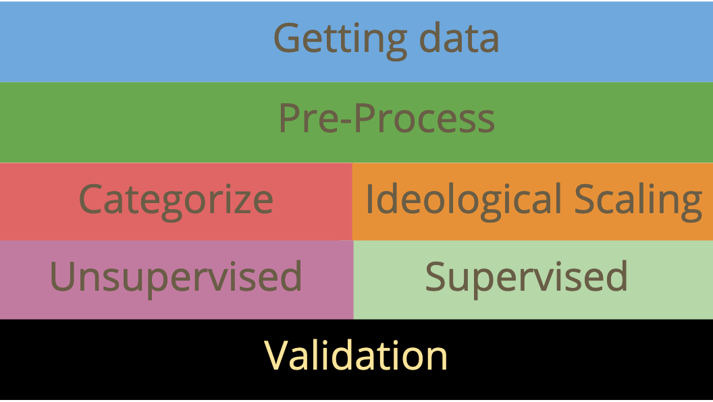
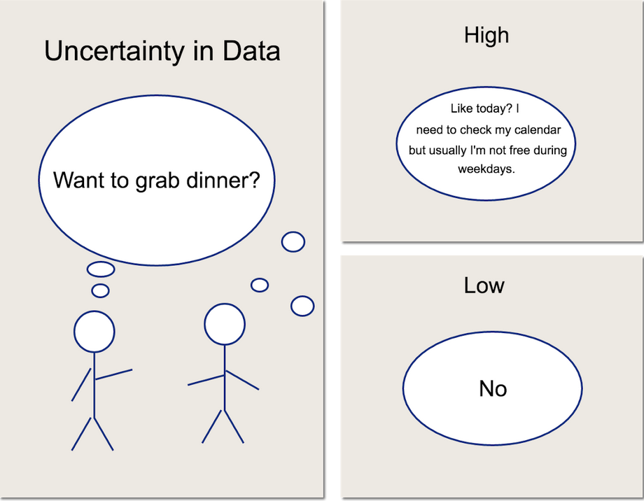
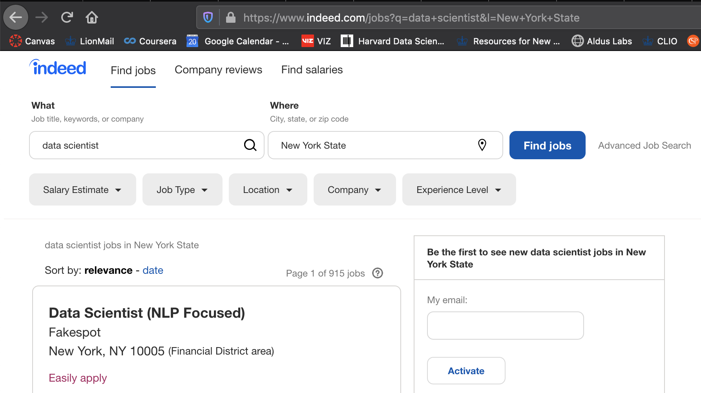

# Introduction to text mining

### I'm Wayne

- Data scientist -> lecturer
- Large scale AgTech expert
- Modern dancer

### Learning goals
- How to convert text to quantitative data
- Common processes and metrics used for text data
- A bit of Python and warnings on scikit-learn packages

### What we won't learn
- extract meaning from text
- linguistics
- machine learning

### Typical NLP Curriculum

A better map is presented by . This does not include the recent "NLP" work though.

### Today's plan
- Working with Text in Python with Jupyter Notebooks
- Common pre-processing Steps
- Quantification of text and common metrics
- Apply it on some text

### Challenges in text data
- Nonstationarity: meaning changes quickly over time, e.g. [#cancel](https://en.wikipedia.org/wiki/Cancel_culture)
- Multiple features can be extracted from the same text

### Key Concepts for Wikipedia
- Preprocessing steps
  - Tokenization
  - Lemmatization
- Quantification of text
  - Bag of words
- Metrics for text
  - Term Frequency Inverse Document Frequency (TF-IDF)
- "Distance" between documents
  - Cosine similarity

### Today's dataset
[Indeed.com](https://indeed.com) helps candidates find job postings

