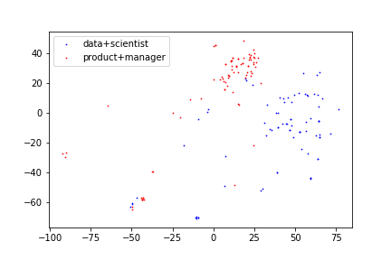

# t-SNE clustering documents

### Clustering the documents
[larger dataset](https://drive.google.com/file/d/1DV5PXPRGl6THkOPQBeX2iFwf0_MIExeC/view?usp=sharing)

Select only the top tf-idf terms:
```
top_tokens = avg_tfidf.sort_values(ascending=False)[:200].index
top_tfidf = tfidf_df[top_tokens]
```

- with the `top_tfidf`, our documents are each expressed using 200 dimensions
- To facilitate plotting, we want to preserve the distance between documents using only 2 dimensions. t-SNE can help achieve this.
- To learn more about t-SNE, here's a [great tutorial](https://youtu.be/RJVL80Gg3lA).

```
import matplotlib.pyplot as plt
from sklearn.manifold import TSNE

red_tfidf = TSNE(n_components=2).fit_transform(top_tfidf)

colors = ['red', 'blue']
subplots = []
titles = []
job_titles = ['data+scientist', 'product+manager']
for title in job_titles:
    subset = [label == title for label in indeed['labels']]
    subplots.append(
      plt.scatter(red_tfidf[subset, 0],
                  red_tfidf[subset, 1],
                  color=colors.pop(),
                  s=0.5))
    titles.append(title)
    plt.legend([subplot for subplot in subplots],
               titles)

# Save the different methods into different plots
plt.show()
```


