# Software Setup for Text Mining Bootcamp

To process the data, we will use several libraries in Python. To interface with Python dynamically, we will leverage Jupyter Notebooks. Finally, to manage the dependencies between Jupyter, Python, and the various packages, we will use Anaconda.

If our setup has potential conflicts, Anaconda will save us before it's too late!

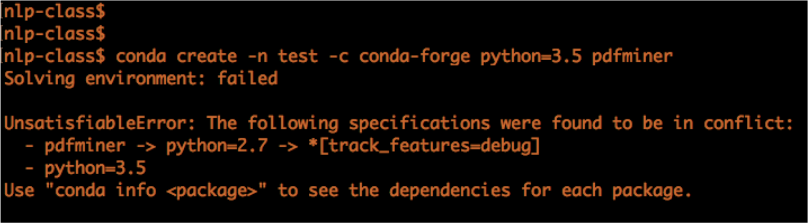

Overall, installing `conda` will automatically install `Python` so there are only 2 steps:
- Install `conda` (we will install Jupyter here as well)
- Install some necessary libraries for the bootcamp

## Installing Anaconda
There are two methods to do this depending on if you're comfortable with the command line:
- Not sure: then just install [Anaconda Navigator](#anaconda-gui-via-anaconda-navigator)
- Yes, then jump ahead to [installing conda](#Command-line-interface-with-Anaconda-via-conda)


#### Anaconda GUI via Anaconda Navigator
1. Please get [Anaconda Navigator](https://docs.anaconda.com/anaconda/navigator/) which is a nice GUI
2. Launch Anaconda Navigator
    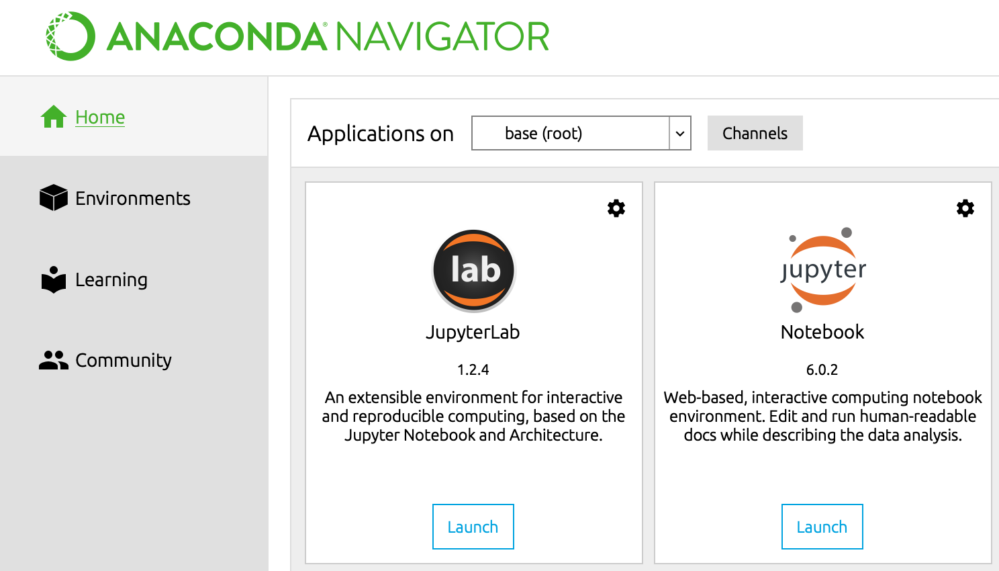
3. Go to `Environments` on the left tab
4. Click on `Create` at the bottom to create a separate environment so the materials here will not conflict with your other work
    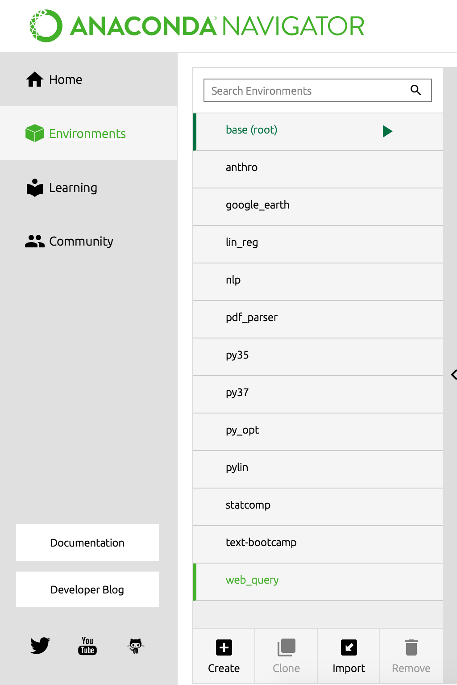
5. Create an environment called `text-mine` (or whatever you prefer) and use the dropdown menu to run under Python version 3.7, then choose `Create`.
    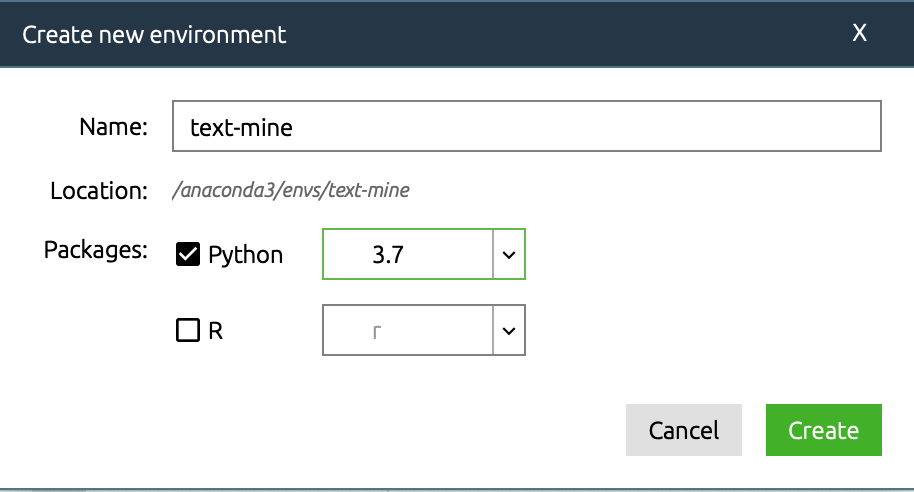
6. Go back to the `Home` tab, make sure you use the dropdown menu behind "Applications on" to `text-mine` (or whatever you called the new environment)
    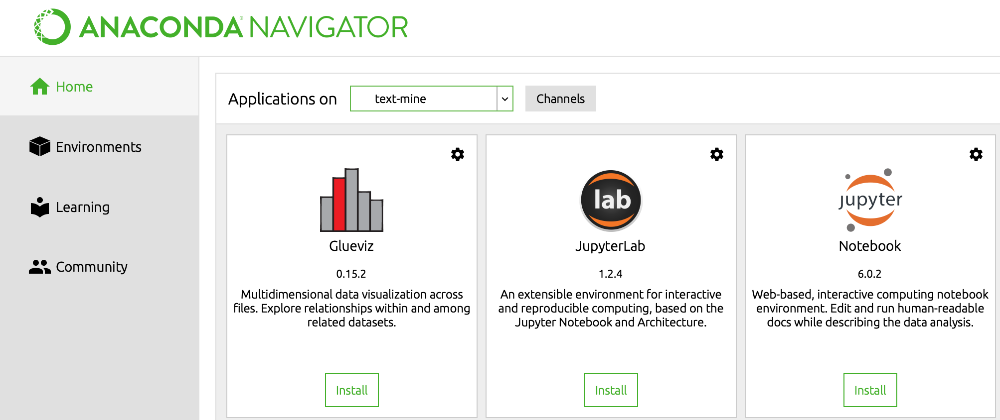
7. If Jupyter has `Install` listed below it, click it to install it. Otherwise, select `Launch` instead. This should launch a few things but ultimately on your default browser, you'll see a jupyter session.
    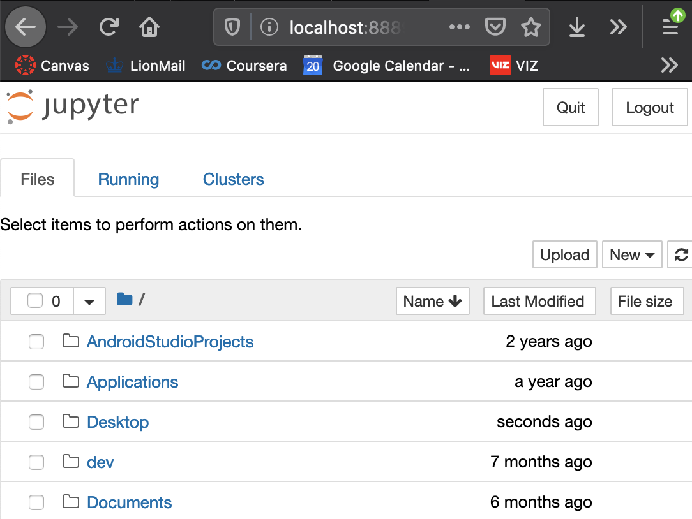
8. Click down your file path to where you want your work stored, then click on `New` on the far right to launch a `Python 3` session.
9. Now you have a functioning Jupyter notebook session
    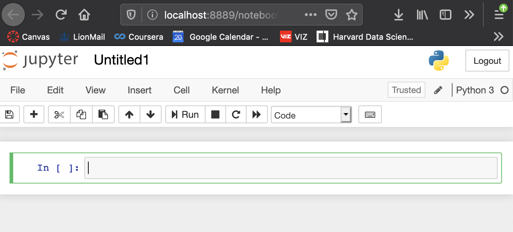

#### Command line interface with Anaconda via conda

1. Please follow [these instructions to install conda](https://docs.conda.io/projects/conda/en/latest/user-guide/install/)
2. Launch your command line interface for Anaconda:
    - on Windows, this is called "Anaconda Command Prompt"
    - on OSX, this is called "Terminal"
    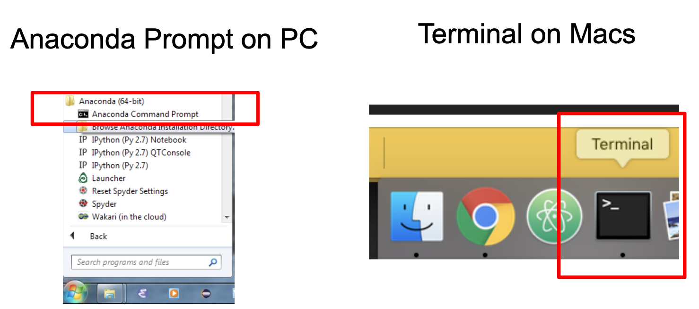
3. Type in the following to create an environment called `text-mine` under Python version 3.7 with Jupyter Notebooks.

    `conda create -n text-mine python=3.7 ipykernel jupyter`

    You will likely be asked to confirm with the packages it'll install. Type in `y` then enter to accept.
4. Type in `conda activate text-mine` and notice how your command prompt changes to `text-mine`
    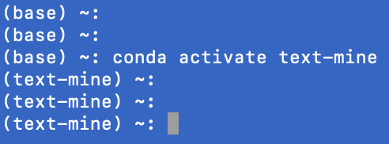

    It's possible that you have an older version of `conda`, then you should type in `source activate text-mine` instead.

5. Navigate to your desired working directory, then type in `jupyter notebook` to launch your jupyter session. This should launch a few things but ultimately on your default browser, you'll see a jupyter session.
    

6. Click on `New` on the far right to launch a `Python 3` session. Now you have a functioning Jupyter notebook session
    

## Installing Python Packages
Python's true value is in its large community of developers and users. To leverage their work, we often will depend on packages outside of the default Python installation. Similar to before, we'll cover the instructions both using [Anaconda Navigator](#installing-packages-using-anaconda-navigator) and the [command line](#Installing-packages-using-conda).

#### Installing packages using Anaconda Navigator
1. Go back to the `Environment` tab on the far left and make sure your desired environment is selected (in this document that's `text-mine`).
    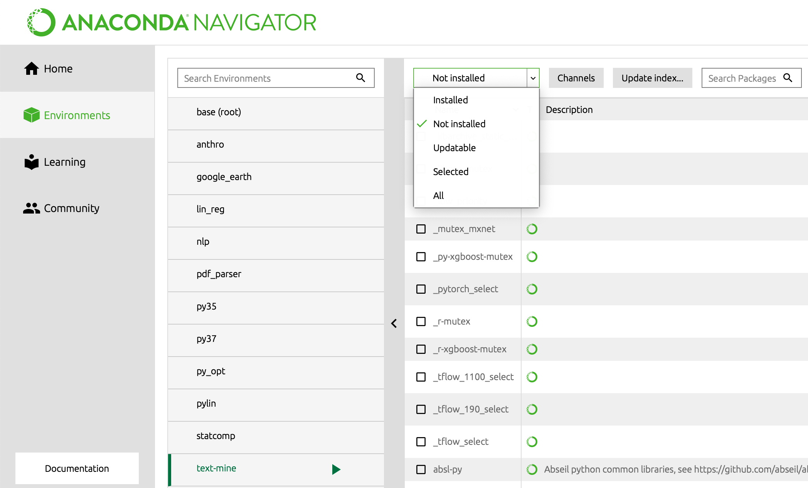
2. Use the dropdown menu shown above to examine the packages not installed.
3. Use the search box to find `scikit-learn`, `pandas`, and `nltk` and make sure they're selected.
    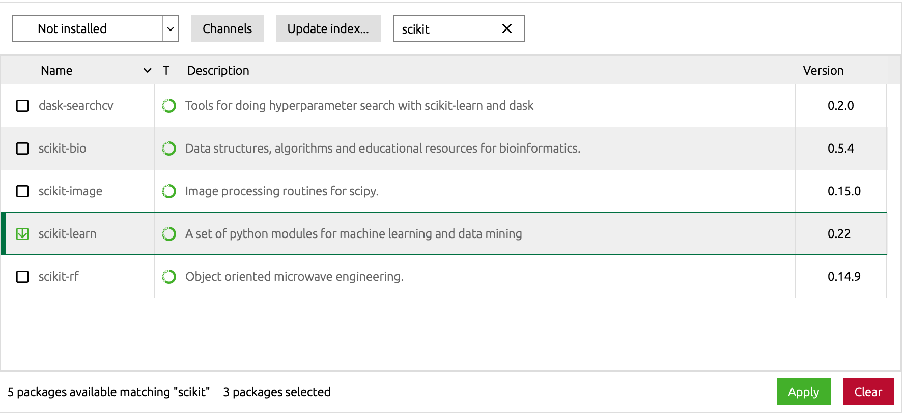

    I would make sure all 3 packages are selected before moving to the next step. Once the  appears, you can safely search for the next package. Notice the number of packages selected are indicated below.
4. (This will take awhile)  Click on `Apply` on the right bottom and wait for the packages to be installed. Click on `Apply` once more to confirm the packages.
5. You should be able to confirm if the installation succeeded by repeating this little example below in your Jupyter Notebook
  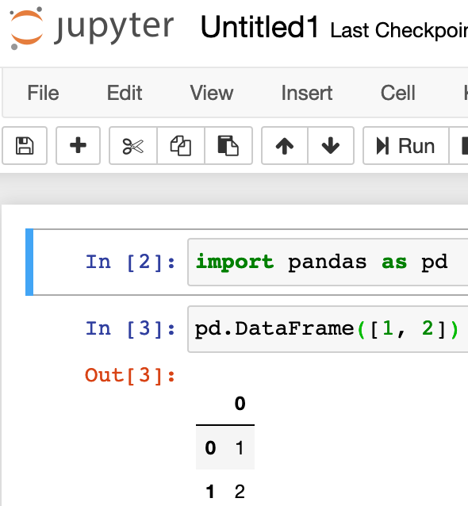


#### Installing packages using conda
1. Make sure your command line prompt is under the environment you created (`text-mine` in this document).
2. We will use the `conda install` command to install packages we need. Specifically, you should type in
    ```
    conda install nltk scikit-learn pandas matplotlib
    ```
    
3. You should be able to confirm if the installation succeeded by repeating this little example below in your Jupyter Notebook
      
