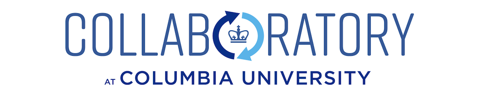
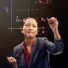

[**[Direct ENTER]**](/Bootcamp-materials/) for bootcamp materials. [**Apply for the boot camp**](https://goo.gl/forms/1UiJgkoN2FFSMYBu1) (Deadline 11:59pm 12/6/2019)

<b> <H1 align="center"> 4th Annual Data Science Boot Camp </H1> </b>

 

### The Columbia [Data Science Institute](http://datascience.columbia.edu/) and [Columbia Enterpreneuship](http://entrepreneurship.columbia.edu/) are organizing the Fourth Winter-Intensive Collaboratory Data Science Boot Camp

The [Collaboratory@Columbia](http://collaboratory.columbia.edu/) is pleased to announce our 4th annual free **Winter-Break Data Science Boot Camp**.  Designed by faculty, research scientists, and postdoctoral scholars from Columbia University’s [Data Science Institute](http://datascience.columbia.edu/), the curriculum includes on-line learning material, introductory lectures and hands-on laboratory experiences. 

The boot camp's *mission* is to enable Columbia faculty members, postdoctoral researchers and senior Ph.D. students to adopt more state-of-the-art data-science tools in their research and educational activities. To achieve this goal, we have designed a new modular model that is different from the previous week-long format. On **January 15th-17th, 2020**, we will have a *data science skill camp* that consists of three one-day long modules taught by instructors on *machine learning*, *Bayesian modeling* and *text mining*. 

[**Apply for the boot camp**](https://goo.gl/forms/1UiJgkoN2FFSMYBu1) (Deadline 11:59pm 12/6/2019)

----

- **When**: 
	- [January 15th – 17th, 2020] Data Science Skill Camp
	
- **Where**: 
	- Room 903 [SSW](http://stat.columbia.edu/location-and-directions/)

- **What**: This year, to encourage participation from Columbia faculty, we have adopted a modular structure for the boot camp with four stand-alone modules:
	- [Day 1] [Introduction to Machine Learning with Python/sklearn.](/Bootcamp-materials/Day1-Machine-Learning/) with Andreas Mueller 
	- [Day 2] [Bayesian Modeling with Stan.](/Bootcamp-materials/Day2-Bayesian-Modeling/) with Ben Goodrich
	- [Day 3] [Text Mining.](/Bootcamp-materials/Day3-text-mining/) with Wayne Lee
	- **Daily schedule**: 9am to 4pm 

- **Who** should apply: Columbia full-time **faculty**, postdoctoral researchers and senior Ph.D. students who have working knowledge of basic probability and statistics, programming and data analytics, and are ready to sharpen their skills to include a training in data science research skills, and/or to create a data science teaching module in a course they teach, and/or to initiate a project in data science. **Seats are limited** (50 for each module), and we will give **priority** to faculty who have applied to or are considering applying to the [Collaboratory fellows fund](http://entrepreneurship.columbia.edu/collaboratory/collaboratory-fellows-fund/).

- Click [here](https://github.com/DS-BootCamp-Collaboratory-Columbia/AY2019-2020-Winter/blob/master/Bootcamp-materials/README.md) to **START** (detailed course information, pre-requisites, and setup instructions.)

[**Apply for the boot camp**](https://goo.gl/forms/1UiJgkoN2FFSMYBu1) (Deadline 11:59pm 12/6/2019)

----
### About the instructors and organizers
   

**[Andreas Mueller](http://amueller.github.io/)** ([@amueller](https://github.com/amueller)) is a lecturer at the [Data Science Institute](http://datascience.columbia.edu/)at Columbia University and author of the O’Reilly book “[Introduction to Machine Learning with Python](http://amueller.github.io/#book)”, describing a practical approach to machine learning with python and scikit-learn. He is one of the core developers of the scikit-learn machine learning library, and he has been co-maintaining it for several years. He is also a [Software Carpentry](http://software-carpentry.org/) instructor. In the past, he worked at the NYU Center for Data Science on open source and open science, and as Machine Learning Scientist at Amazon. You can find his full  cv [here](http://amueller.github.io/cv_andreas_mueller.pdf). His mission is to create open tools to lower the barrier of entry for machine learning applications, promote reproducible science and democratize the access to high-quality machine learning algorithms.

**[Ben Goodrich](https://github.com/bgoodri) is a core instructor of QMSS and teaches Missing Data, Bayesian Statistics, Data Mining, Data Analysis, and Theory and Methodology at QMSS. Previously, he was a Post-doctoral Researcher working with Andrew Gelman at the Applied Statistics Center at Columbia University (primarily on the mi R package for missing Data). He received his PhD in Government and Social Policy from Harvard University in 2010 where his dissertation, It’s Not All About the Benjamins: Political Economy and Social-Psychology Theories of Welfare State Preferences, derived two new estimators and applies them to cross-country survey data to test competing theories of preferences for redistribution and other welfare state programs. He previously served as a research assistant at the Peterson Institute for international Economics.  His research interests include methodology, comparative politics and political economy. 

**[Wayne Lee](https://github.com/leewtai)** is a Lecturer in Discipline, Department of Statitics, Columbia University. He is a Taiwanese American Statistician with a passion for dancing. He was a practicing data scientist for 6 years in industries like social networks (LinkedIn), agriculture (The Climate Corporation), and heavy manufacturing (United Technologies) before joining the Columbia Statistics department as a lecturer in discipline. Wayne is on a quest to make the world a better place through statistics education. His training has been focused on uncertainty quantification for global climate models and his industry experience is mostly focused on AB testing and business-focused data quality issues.  

**[Tian Zheng](http://www.stat.columbia.edu/~tzheng/)** ([@tz33cu](https://github.com/tz33cu)) is Professor of Statistics, Associate Director for Education of Data Science Institute at Columbia University. She develops novel methods for exploring and understanding patterns in complex data from different application domains such as biology, psychology, climatology, and etc. Her current projects are in the fields of statistical machine learning, spatiotemporal modeling and social network analysis. Professor Zheng’s research has been recognized by the 2008 Outstanding Statistical Application Award from the American Statistical Association (ASA), the Mitchell Prize from ISBA and a Google research award. She became a Fellow of American Statistical Association in 2014. Professor Zheng is the receipt of 2017 Columbia’s Presidential Award for Outstanding Teaching. In 2018, she will be the chair-elect for ASA’s section on Statistical Learning and Data Science. She is on the advisory board for STATS at Sense About Science America that targets to develop a statistical literate citizenry.

### About [Collaboratory@Columbia](http://collaboratory.columbia.edu/)
Jointly founded by Columbia University’s [Data Science Institute](http://datascience.columbia.edu/) and [Columbia Entrepreneurship](http://entrepreneurship.columbia.edu/), The [Collaboratory Program](http://collaboratory.columbia.edu/) is a university-wide program dedicated to supporting collaborative curricula innovations designed to ensure that all Columbia University students receive the education and training that they need to succeed in today’s data rich world.

